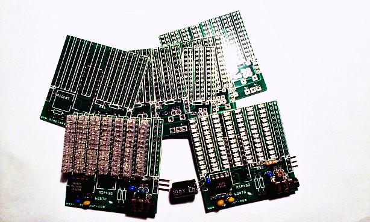
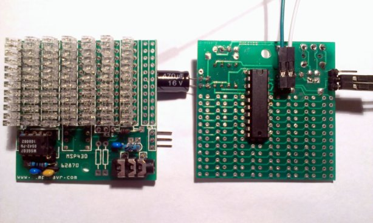
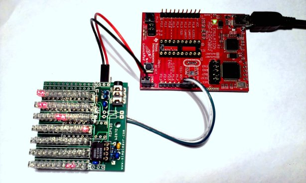
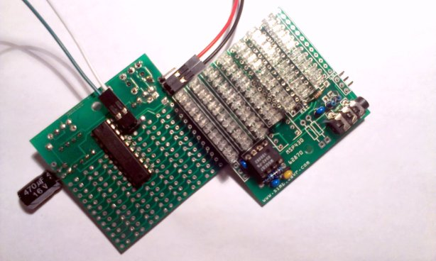

## Compact Audio Spectrum Analyzer


`[July 2013]` Originally created.

**7 Band Compact Audio Sprectrum Analyzer based on msgeq7 and msp430 MCU.**


<iframe width="560" height="315" src="https://www.youtube.com/embed/ctzthowCu4Q" frameborder="0" allow="autoplay; encrypted-media" allowfullscreen></iframe>
<br><br>
 


### Credits


This project is based on [RobG's code](http://www.43oh.com/2011/09/launchpad-audio-spectrum-analyzer-with-the-msgeq7/) to drive the msgeq7 w/ a msp430 mcu


### Description


 


There is not much of a schematic as one can easily google 'msgeq7' to get a typical hookup diagram. The msp430 mcu interfaces w/ the msgeq7 via 3 pin.


Reset and Strobe pins are used to control msgeq7 and they are 'low' at rest. Pulling Reset 'high' for 100ns will signal the msgeq7 that we need readings. After that each successive 'high' pulse on the Strobe pin will advance / cycle the frequency band for reading, during which we use the msp430 adc10 channel to read the amplitude of

each of the 7 frequency bands.


If you are using my circuit board design, there are a few connections not being used, they were there because I was experimenting the idea of cascading three boards and expanding the frequency band to 21 (instead of 7). The 8th column being one of these experiments and you don't need to populate them.


### Features


- msp430 value line 20 pin w/ adc10 can be used, I used msp430g2452
- Direct drive 7 x 12 led array w/ multiplexing row and columns and polarity
- Compensation for 'noise floor' of circuit built via a pre-fixed table array
- Logarithm mapping of adc values to volume unit dot levels
- Choice of one-dot, two-dot and bar type of display (decide at build time)
- Peak dot indicator avaliable (decide at build time)


### Parts / Bill of Materials


- MSP430G2452/G2553 mcu, or 20 pin dip device w/ 2k+ flash will do
- Custom printed circuit board
- MSGEQ7 ic
- 1 x 47k pull up resistor for msp430
- 1 x 200k, 2 x 22k resistors
- 2 x 0.1uF, 1 x 33pF capacitors
- 1 x 3.5mm audio socket
- A few header pins (1x3, 1x3, 1x2)
- optional 0.1uF bypass caps for both ICs
- optional 100-1000uF cap for power source


### Schematic


```

        c0    c1    c2    c3    c4    c5    c6    NC
     R0  +-----+-----+-----+-----+-----+-----+-----+
         |\ \  |     |     |     |     |     |     |
         | v ^ |     |     |     |     |     |     |
         |  \ \|     |     |     |     |     |     |
     R1  +-----+-----+-----+-----+-----+-----+-----+

         . a pair of leds are connected to each column + row node
         . they are arranged in opposing cathode / anode polarities
         . there are 7 columns x 12 rows of leds
         . the 12 rows are arrange in 2 banks of opposing polarity
         . total io pin used is than 7 + 6 = 13 pins

                MSP430x2xx
             -----------------
         /|\|                 |              /|\  MSGEQ7
          | |                 |               |  ------------
          --|RST              |               --|(1)Vdd      | .01uF
            |                 |                 |    Audio(5)|--||--o--[ 22k ]--o L in
            |             P1.0|<-- ADC_IN ------|(3)Out      |      |
            |             P1.1|--- RESET ------>|(7)Reset    |      |
            |             P1.2|--- STROBE ----->|(4)Strobe   |      o--[ 22k ]--o R in
            |             P2.6|--> Col6         |            |
            |             P2.7|--> Col5         |            |             /|\
            |                 |                 |            |              |
            |             P2.3|--> Col0         |    Clkin(8)|--[ 200k]-----o
            |             P2.4|--> Col1         |       C`6`|-------o      |
            |             P2.5|--> Col2         |            |       |      = 33pF
            |             P1.6|--> Col3         |      Gnd(2)|--o    = .1uF |
            |             P1.7|--> Col4         |            |  |    |      |
            |                 |                                ---  ---    ---
            |             P2.2|--> Row0/6                      ///  ///    ///
            |             P2.1|--> Row1/7
            |             P2.0|--> Row2/8       0.1uF by-pass capacitor for both
            |             P1.5|--> Row3/9
            |             P1.4|--> Row4/A
            |             P1.3|--> Row5/B
            |                 |

```


### Construction


The project could be built on perf board, or in my case a custom PCB. I used Fritzing to design my PCB as it's simple to use. You can find the design from my github link below.


The PCB does not have all components clearly marked. If you are using my PCB design, please follow the schematic and the photo below for component placement.


 


- The 20 pin msp430 is to be mounted at the back side of the PCB, head face south
- 8 pin msgeq7 mounts on the front side, head face east
- Resistor closest to msgeq7 is a 200k
- Blue caps shown in photo are 0.1uFs
- The Beige cap is a 33pF
- Two standing resistors close to the 3.5mm audio socket are 22ks
- A 47k msp430 reset pull-up is needed just avobe the 22ks
- Additional bypass, power filter capacitor can be used (bug soldered) as needed
- If your input source is mono, you can omit the audio in merging resistors
- You will also need a programming device that does SBW, I used a LaunchPad


### Software / Firmware


Source code and PCB layout can be found in [my github repo](https://github.com/simpleavr/msp430_msgeq7)


I had used mspgcc to build the firmware but it should also works w/ CCS.

The compile / link command is shown below, there is only one single c file for simplicity.

You may need to adjust a bit based on your toolchain setup


```
msp430-gcc -Os -Wall -ffunction-sections -fdata-sections -fno-inline-small-functions -Wl,-Map=msp430_msgeq7.map,--cref -I/cygdrive/c/mspgcc-20120406-p20120502/bin/../msp430/include -mmcu=msp430g2553 -o msp430_msgeq7.elf msp430_msgeq7.c
msp430-objdump -DS msp430_msgeq7.elf
msp430-strip msp430_msgeq7.elf
msp430-size --totals msp430_msgeq7.elf
```


There are two arrays / maps inside the code that you should adjust based on your usage.


comps[] should contain the 'noise floor' of your build. These should be your adc values from

msgeq7 when there is no sound input (but connected to your source).


lvls[] is a psuedo logarithm scale mapping to translate adc values to the 12 vu led levels.

You can adjust these values based on your input amplitude and/or taste.


There are also defines that can affect the visuals.

- MODE_DOT is for a single dot bounce show
- MODE_PEAK allows showing 'peak' signals
- MODE_2DOT bounces two dots instead of one dot
- For bar-graph, just do not define MODE_DOT and MODE_2DOT


The SBW (spy-by-wire) programming is done thru a launchPad. There is a 2 pin header at the back of the

PCB for this purpose. You do not need to solder the header pins as the hole diameter is tight and

friction is enough to make good temporary contact (the same is true for the 3 pin power headers)


You can follow the photo below on how it's done. Just remember to remove any mcu on the launchpad when you do this.


Hookup to Launchpad for SBW programming


 


Backside shown, 4 jumpers required


 


You will also find that there are unpopulated components on the PCB. They are an unfinished attempt

to bring together 3 PCBs to form a 20 band spectrum analyzer. I am not going to describe it and

if you are interested, you can explore yourself.


The basic idea is have 2 io pins toggle 2 additional resistors to 'alter' the msgeq7 RC tank so that it gives us another 2 set of 7 frequency bands.

implements a one wire communication (via 3rd pin on 3 pin power header) to send vu values to the other 2 PCB.

the other 2 PCBs will not have msgeq7s on board but they have 8 columns of leds, while the master PCB drives 6 columns plus doing the msgeq7.


I had temporary / permanently abandon this cascading PCB idea for now so if you try, you are on your own.


